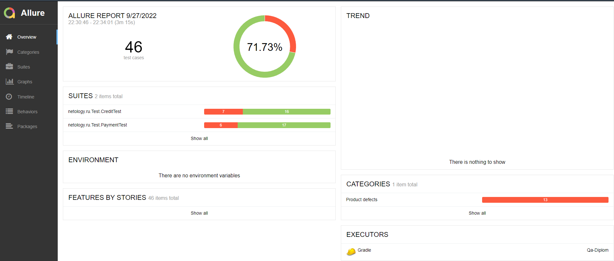
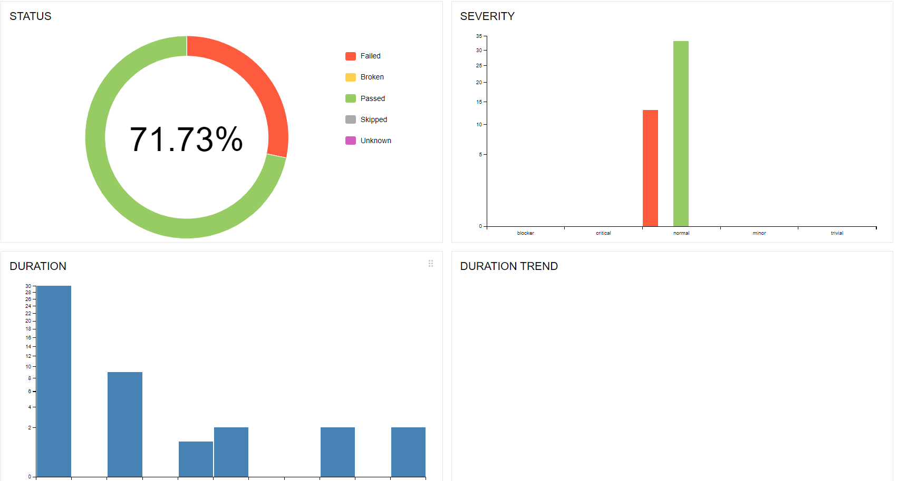

# Краткое описание
***
Автоматизировно тестирование комплексного сервиса покупки тура, взаимодействующего с СУБД и API Банка.

1. На первом этапе было проведено исследовательское, мануальное тестирование и составлен план автоматизации;  
2. На втором этапе была произведена автоматизация тестовых сценариев;  
3. На третьем этапе были составлены отчеты о проведенном тестировании.
***
# Количество тест-кейсов 
***
Всего выполнено 46 автоматизированных тест-кейсов.

***
# Процент успешных/не успешных тест кейсов
Из 46 тест кейсов у нас:
* 33 успешных – что составляет 72 %
* 13 не успешных - что составляет 28 %

***
# Общие рекомендации
***
1. Устранить [дефекты](https://github.com/Bangold666/QA_Diploma/issues), обнаруженные на этапе тестирования, в порядке обозначенной критичности;  
2. Добавить уникальные идентификаторы для элементов страниц (test-id) для ускорения и упрощения автоматизации тестирования;  
3. Составить подробную и однозначную документацию к приложению. 
